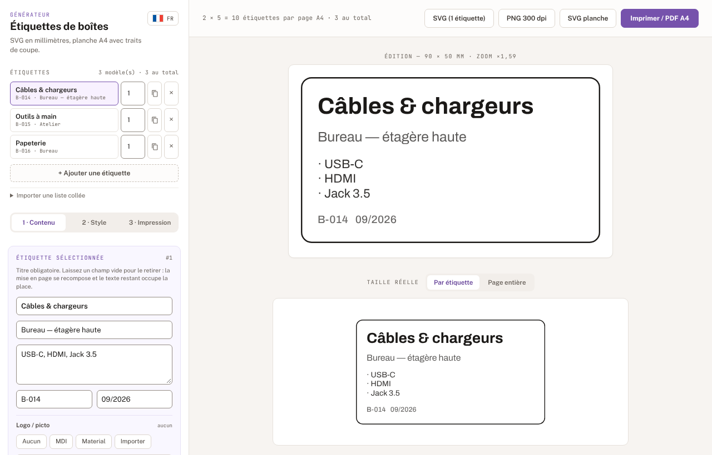

# Printed Labels maker

A small web page for making box labels and printing them on an A4 sheet.

**Use it here: https://printed-labels.roma.moonmakers.fr/**



You write a list of labels (a title, a subtitle, what is in the box, a code, a
date), pick an icon, set the size, and the page lays them out on A4 with crop
marks. Print it, or save it as a PDF from the print dialog, cut along the marks,
done.

Everything happens in the browser. There is no account and no server code. The
icons and the QR generator are copies kept in this repository, and the fonts
come from Google Fonts. Nothing you type is sent anywhere, but nothing is saved
either. Reload the page and the list is gone, so if you have forty
labels to make, keep them in a text file and paste them in (see below).

## What it does

- **Labels in millimetres.** Width, height, inner margin, border and corner
  radius are all set in mm, with a few common sizes one click away (90×50,
  70×37, 105×48, 50×50). What you see at "actual size" is what comes out of the
  printer, as long as the print dialog is at 100% and not "fit to page".
- **Empty fields disappear.** Only the title is required. Leave the subtitle or
  the code empty and the layout closes the gap, and the rest of the text gets
  the room. Text can also shrink to fit the label height, or not, your choice.
- **Icons.** Search the Material Design Icons or Material Symbols sets, or
  upload your own image. One icon can be applied to every label at once.
- **QR code.** Optional, drawn under the icon. It holds the label's code by
  default, or any text you give it.
- **Copies.** Each label has a copy count, so ten identical "Cables" boxes are
  one line, not ten.
- **Two ways to fill a sheet.** Print the whole list, or take the selected label
  and fill the page with it.
- **Exports.** One label as SVG, the sheet as SVG, one label as a 300 dpi PNG,
  or print / PDF for the full run.
- **24 fonts**, colours for the border, background and text.
- **Seven languages**: French, English, Spanish, German, Italian, Portuguese and
  Dutch. It opens in your browser's language and falls back to English.

### Pasting a list

Open "Import a pasted list" and put one label per line, fields separated by `|`:

```
Title | Subtitle | contents, contents | code | date
```

For example:

```
Cables & chargers | Office, top shelf | USB-C, HDMI, 3.5 jack | B-014
Hand tools | Workshop | Pliers, screwdrivers, keys | B-015
Stationery | Office | Pens, notebooks, sticky notes | B-016
```

A `;` or a tab works as a separator too, so rows copied out of a spreadsheet
paste as they are. Trailing fields can be left out, and a sixth one, if present,
becomes the QR content. This replaces the current list rather than adding to it.

## How it is built

There is no build step. `site/` is the website, exactly as it is served:
one HTML page, one script, one stylesheet and a `vendor/` folder. No framework,
no bundler, nothing to install to change a colour.

`vendor/` is filled by `tools/vendor.py`, which downloads each third-party file
and records its source URL and SHA-256 in `site/vendor/SOURCES.json`.
`tools/vendor.py --check` verifies the files on disk against that list without
touching the network.

Fonts are the exception: the page loads them straight from Google Fonts, both
the interface font and the 24 label fonts, so the list can grow without the
repository growing with it.

The site is hosted on Cloudflare Workers as static assets, configured in
`wrangler.jsonc`. There is no Worker script: Cloudflare serves the files and adds
the headers from `site/_headers`, which include a Content Security Policy strict
enough that a request to any origin other than the site and Google Fonts would
simply be blocked.

## Working on it

You need [just](https://github.com/casey/just), Docker, Python 3 and Node 22.
Run `just` on its own to see every recipe.

```sh
just local                   # the site on http://127.0.0.1:8000/, works offline
just dev                     # local server with the production headers (wrangler dev)
```

`just local` downloads every font once into `local/fonts/`, which git ignores,
then serves `site/` with the Google Fonts links pointed at that folder. After the
first run it needs no network at all, which is handy on a train. The rewrite
happens in the local server (`tools/local.py`), so the site itself has no
offline mode to keep in step. Delete `local/fonts/` to fetch the fonts again.

Lint, tests and screenshots all run inside one pinned Docker image, the same
one CI uses, so a result on a laptop means the same thing as a result on GitHub.

```sh
just lint                    # every checker, changes nothing
just fmt                     # apply the formatters
just test site               # unit tests, config check, then the browser scenario
just ci                      # exactly what CI runs, in the same order
```

### Screenshots as tests

`test/site/screenshots.py` drives the real page in a headless Chromium through
every screen: importing a list, editing rows, the three tabs, fonts, icon
search, QR, the print modes, a couple of languages. Each step checks what it
expects to see before it takes a picture, and any console error or request
to somewhere other than Google Fonts fails the run.

The fonts come from Google during the tests too. If Google ships a new version
of one, the screenshots can change without any change here: regenerate them and
check the diff is only the font.

The pictures are committed under `test/screenshot/site/` and CI fails if a run
produces different bytes. So a change that moves a single pixel shows up in
review. When the change is on purpose:

```sh
just site-gui-goldens        # regenerate the screenshots
```

and commit them with the change. `just ci` compares against `HEAD`, so commit
first, then run it.

## Deploying

Production is the `Prod` branch. Work goes on a short branch, gets a pull request
into `Prod`, and can only be merged once CI is green. Cloudflare Workers Builds
then deploys every push to `Prod` by itself, so there is no deploy job and no
Cloudflare secret in GitHub.

`just deploy` is the fallback for when the Cloudflare build is the broken part.
It refuses to run off `Prod`, with uncommitted changes, or when your `HEAD` is
not what is on `origin/Prod`, so it can only ship something CI has already seen.
